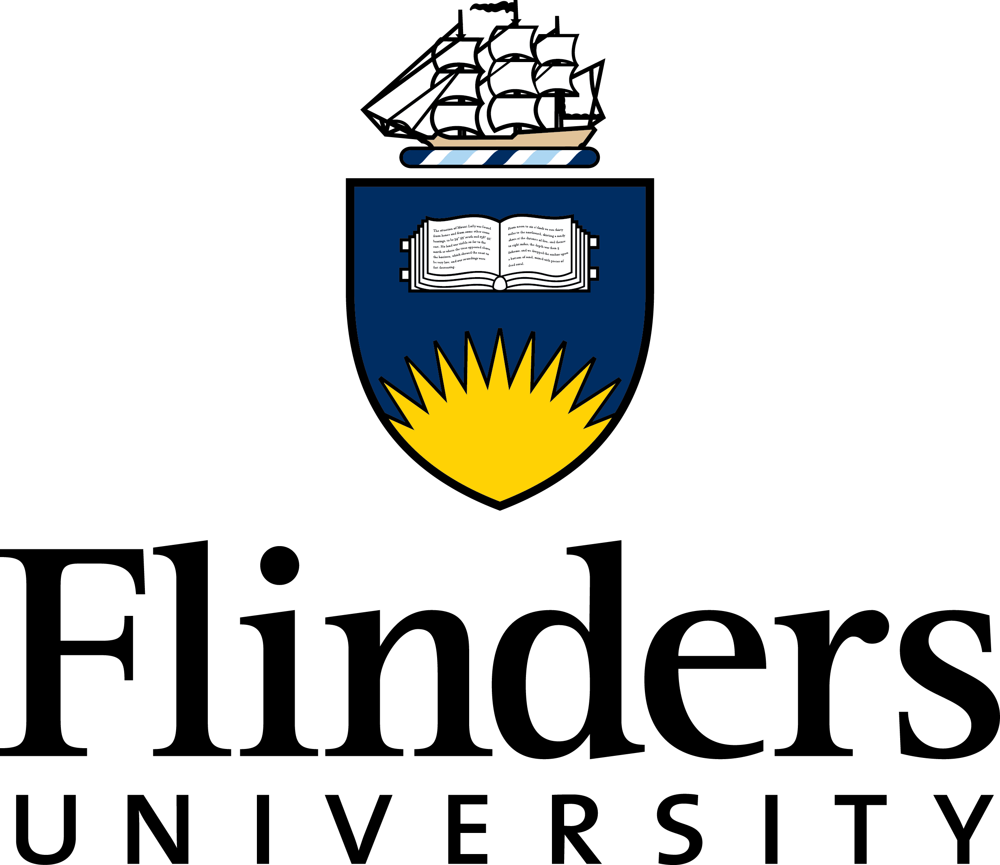

## Background
<em>Marni naa pudni</em> (welcome) to the Global Ecology Laboratory (<a href="https://globalecologyflinders.com/partuyarta-ngadluku-wardli-kuu/"><em>Partuyarta Ngadluku Wardli Kuu</em></a>) that sits within the Ecology, Evolution and Environment Research Section of the College of Science and Engineering at Flinders University in South Australia.

We have a wide range of interests in ecological research, with a particular focus on palaeo-ecological systems and forecasting future ecosystems. We are also the main Modelling Node of the Australian Research Council Centre of Excellence for Australian Biodiversity and Heritage.

